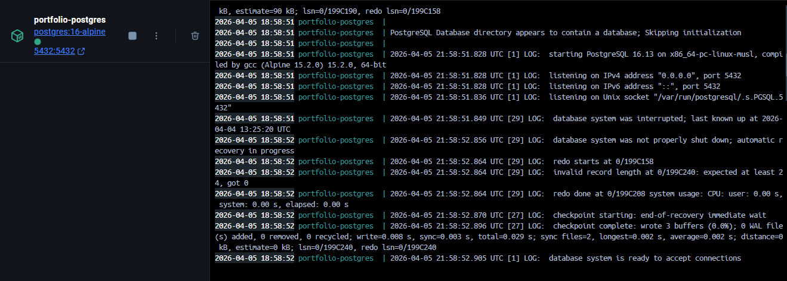
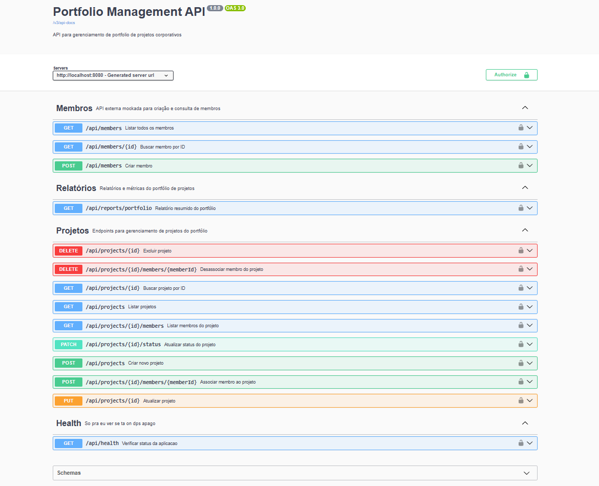
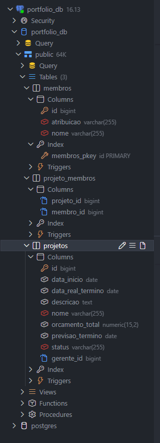
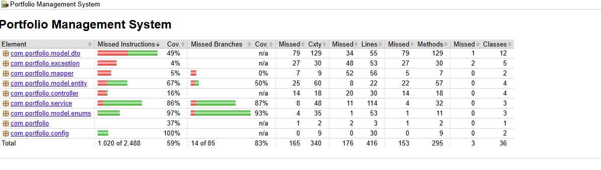
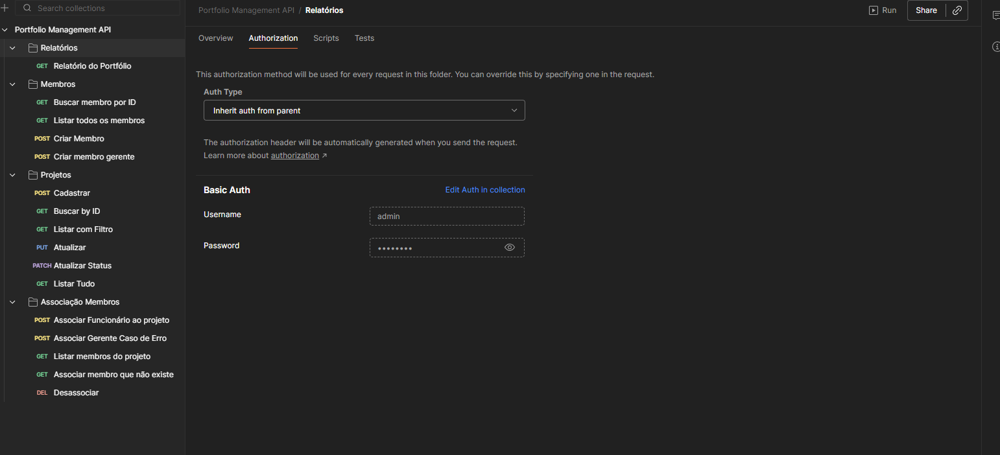
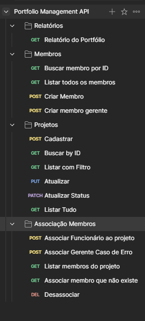

# Portfolio Management System

Sistema pra gerenciar projetos de uma empresa. Basicamente um CRUD de projetos com controle de status, membros da equipe, orçamento e cálculo de risco. Tudo via API REST com Spring Boot.

## Stack

- **Java 17** + **Spring Boot 3.2.5**
- **Spring Data JPA / Hibernate** pra persistência
- **PostgreSQL 16** rodando em Docker
- **Spring Security** com Basic Auth (usuário em memória)
- **Swagger** pra documentação dos endpoints
- **JaCoCo** pra cobertura de testes
- **GitHub Actions** pra CI (roda os testes a cada PR)

## Estrutura de pastas

```
src/main/java/com/portfolio/
├── controller/     → endpoints REST
├── service/        → regras de negócio
├── repository/     → acesso ao banco
├── model/
│   ├── entity/     → Project, Member
│   ├── enums/      → status, risco, cargo
│   └── dto/        → request e response
├── mapper/         → entity <-> DTO
├── config/         → security, swagger
└── exception/      → exceções e handler global
```

## Rodando o projeto

Precisa de: **Java 17+**, **Maven** e **Docker**

### 1. Subir o PostgreSQL

```bash
docker-compose up -d
```

Sobe o banco na porta 5432, já cria o database `portfolio_db`.



### 2. Subir a aplicação

```bash
mvn spring-boot:run
```

Sobe em `http://localhost:8080`. As tabelas são criadas sozinhas pelo Hibernate.

### 3. Swagger

```
http://localhost:8080/swagger-ui.html
```



### 4. Login

```
Usuário: admin
Senha:   admin123
```

Basic Auth em todas as rotas.

## Banco de dados

3 tabelas criadas automaticamente:

- `projetos` - dados do projeto (nome, datas, orçamento, status, gerente)
- `membros` - nome e cargo (atribuição)
- `projeto_membros` - relação N:N entre projeto e membro



## Endpoints

### Membros - `/api/members`

API mockada pra simular um serviço externo de cadastro de membros.

| Método | Rota | O que faz |
|--------|------|-----------|
| POST | `/api/members` | Cria membro |
| GET | `/api/members` | Lista todos |
| GET | `/api/members/{id}` | Busca por ID |

Cargos: `FUNCIONARIO`, `GERENTE`, `DIRETOR`

### Projetos - `/api/projects`

| Método | Rota | O que faz |
|--------|------|-----------|
| POST | `/api/projects` | Cria projeto |
| GET | `/api/projects` | Lista (com paginação e filtro) |
| GET | `/api/projects/{id}` | Busca por ID |
| PUT | `/api/projects/{id}` | Atualiza |
| DELETE | `/api/projects/{id}` | Exclui |
| PATCH | `/api/projects/{id}/status` | Muda o status |

Filtros na listagem:
```
GET /api/projects?nome=vendas&status=EM_ANALISE&page=0&size=10
```

### Membros no projeto

| Método | Rota | O que faz |
|--------|------|-----------|
| POST | `/api/projects/{id}/members/{memberId}` | Associa membro |
| DELETE | `/api/projects/{id}/members/{memberId}` | Remove membro |
| GET | `/api/projects/{id}/members` | Lista membros do projeto |

### Relatório - `/api/reports`

| Método | Rota | O que faz |
|--------|------|-----------|
| GET | `/api/reports/portfolio` | Resumo geral do portfólio |

Retorna: projetos por status, orçamento por status, média de duração dos encerrados e total de membros alocados.

## Regras de negócio

### Fluxo de status

O status segue essa ordem e não dá pra pular etapa:

```
EM_ANALISE → ANALISE_REALIZADA → ANALISE_APROVADA → INICIADO → PLANEJADO → EM_ANDAMENTO → ENCERRADO
```

**CANCELADO** pode ser aplicado em qualquer momento. Quando o projeto é encerrado, a data real de término é preenchida automaticamente.

### Risco

Calculado automaticamente com base no orçamento e prazo do projeto:

| Risco | Orçamento | Prazo |
|-------|-----------|-------|
| Baixo | até R$ 100.000 | até 3 meses |
| Médio | R$ 100.001 a R$ 500.000 | 3 a 6 meses |
| Alto | acima de R$ 500.000 | acima de 6 meses |

Pra médio e alto, basta bater **um** dos critérios.

### Exclusão

Projeto com status **INICIADO**, **EM_ANDAMENTO** ou **ENCERRADO** não pode ser excluído.

### Membros

- Só **FUNCIONARIO** pode ser associado a projeto
- Máximo **10 membros** por projeto
- Um membro não pode estar em mais de **3 projetos ativos** ao mesmo tempo

## Testes

```bash
mvn test
```

Pra ver o relatório de cobertura:

```bash
mvn test jacoco:report
```

Abre `target/site/jacoco/index.html` no navegador.

Cobertura nas regras de negócio:
- **service** → 86% instruções, 87% branches
- **enums** → 97% instruções, 93% branches



## Postman

Configura o Basic Auth na raiz da collection pra não precisar setar em cada requisição:



Organização das pastas:



## CI

Tem uma pipeline no GitHub Actions que roda os testes automaticamente em cada PR. Usa o profile de teste com H2 em memória, sem precisar de banco externo.
